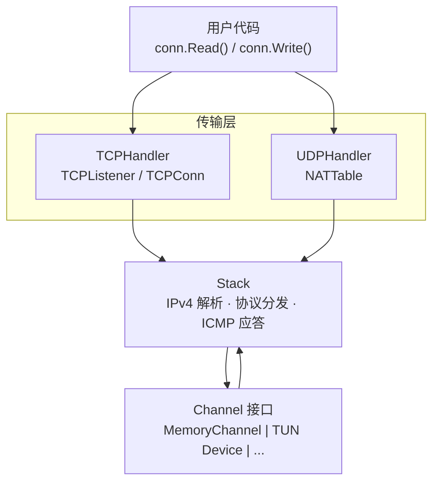
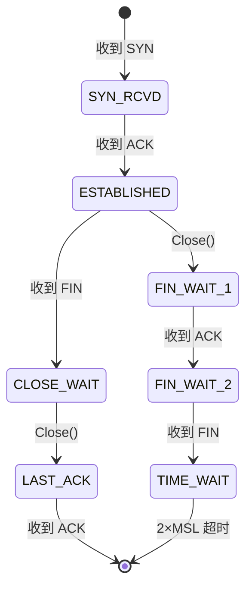

# netstack

纯 Go 实现的用户态 IPv4 网络协议栈，专为 TUN 网关场景设计。

## 特性

- **IPv4** — 头部解析/构建、校验和验证
- **TCP** — 服务端全状态机：三次握手、数据传输、优雅关闭
  - TCP 选项：MSS、窗口缩放 (RFC 7323)、SACK (RFC 2018)
  - 拥塞控制：New Reno 快速恢复 (RFC 5681)
  - 可靠重传：RTO 定时器、最大重试限制
- **UDP** — NAT 转发，自动将虚拟网络的 UDP 流量转发到真实网络
- **ICMP** — 自动 Echo Reply（ping 响应）
- 零拷贝包缓冲区 + `sync.Pool` 对象复用

## 架构



## 安装

```bash
go get github.com/Zwlin98/netstack
```

## 快速开始

### 创建网络栈并接收 TCP 连接

```go
package main

import (
	"fmt"

	"github.com/Zwlin98/netstack/channel"
	"github.com/Zwlin98/netstack/stack"
	"github.com/Zwlin98/netstack/tcpip"
	"github.com/Zwlin98/netstack/transport/tcp"
	"github.com/Zwlin98/netstack/transport/udp"
)

func main() {
	// 1. 创建 Channel（实际使用时替换为 TUN 设备）
	ch := channel.NewMemory(1500)

	// 2. 创建协议栈
	s := stack.New(ch)

	// 3. 注册传输层处理器
	tcpHandler := tcp.NewTCPHandler(s)
	udpHandler := udp.NewUDPHandler(s)
	s.RegisterHandler(tcpip.TCPProtocolNumber, tcpHandler)
	s.RegisterHandler(tcpip.UDPProtocolNumber, udpHandler)

	// 4. 启动
	s.Start()
	defer s.Stop()

	// 5. 接受 TCP 连接
	for {
		conn, addr, err := tcpHandler.Listener().Accept()
		if err != nil {
			break
		}
		go handleConn(conn, addr)
	}
}

func handleConn(conn *tcp.TCPConn, addr tcpip.FullAddress) {
	defer conn.Close()
	fmt.Printf("新连接: %s:%d\n", addr.Addr, addr.Port)

	buf := make([]byte, 4096)
	for {
		n, err := conn.Read(buf)
		if err != nil {
			return
		}
		conn.Write(buf[:n]) // echo
	}
}
```

### 接入 TUN 设备

实现 `channel.Channel` 接口即可接入真实 TUN 设备：

```go
type Channel interface {
	ReadPacket(buf []byte) (int, error)  // 从设备读一个 IP 包
	WritePacket(data []byte) error       // 向设备写一个 IP 包
	Close() error
	MTU() int
}
```

### UDP NAT 转发

UDP 处理器自动将虚拟网络流量 NAT 转发到真实网络：

```go
udpHandler := udp.NewUDPHandler(s)
udpHandler.SetNewSessionCallback(func(flow udp.FlowID) bool {
	return true // 接受所有 UDP 流
})
s.RegisterHandler(tcpip.UDPProtocolNumber, udpHandler)
```

DNS 查询（端口 53）使用 10 秒短超时，其他 UDP 流量 60 秒超时。

## 包结构

| 包 | 说明 |
|---|------|
| `tcpip` | 核心类型：`Address`、`FullAddress`、协议号、错误定义 |
| `header` | 零拷贝协议头视图：IPv4、TCP、UDP、ICMPv4 + 校验和 |
| `packet` | `PacketBuffer` — 带 headroom 的包缓冲区，`sync.Pool` 复用 |
| `channel` | `Channel` 接口 + `MemoryChannel`（内存实现，用于测试） |
| `stack` | 协议栈核心：IPv4 解析、协议分发、ICMP、读写循环 |
| `transport/tcp` | TCP 实现：`TCPHandler` / `TCPListener` / `TCPConn` |
| `transport/udp` | UDP NAT 转发：`UDPHandler` / `NATTable` |

## TCP 状态机



## 设计要点

- **IPv4-only** — 不支持 IPv6
- **服务端 TCP** — 支持 Listen/Accept，不支持主动 Dial
- **TUN 网关** — 面向内网设备，client→gateway 存在真实网络 RTT
- **gVisor 风格** — `[]byte` 命名类型作为协议头视图，零分配解析

## 测试

```bash
go test ./...
```

TCP 测试包含从 [gVisor](https://github.com/google/gvisor) 移植的工业级测试用例，覆盖握手边界条件、拥塞控制、连接关闭和 RFC 合规性。
