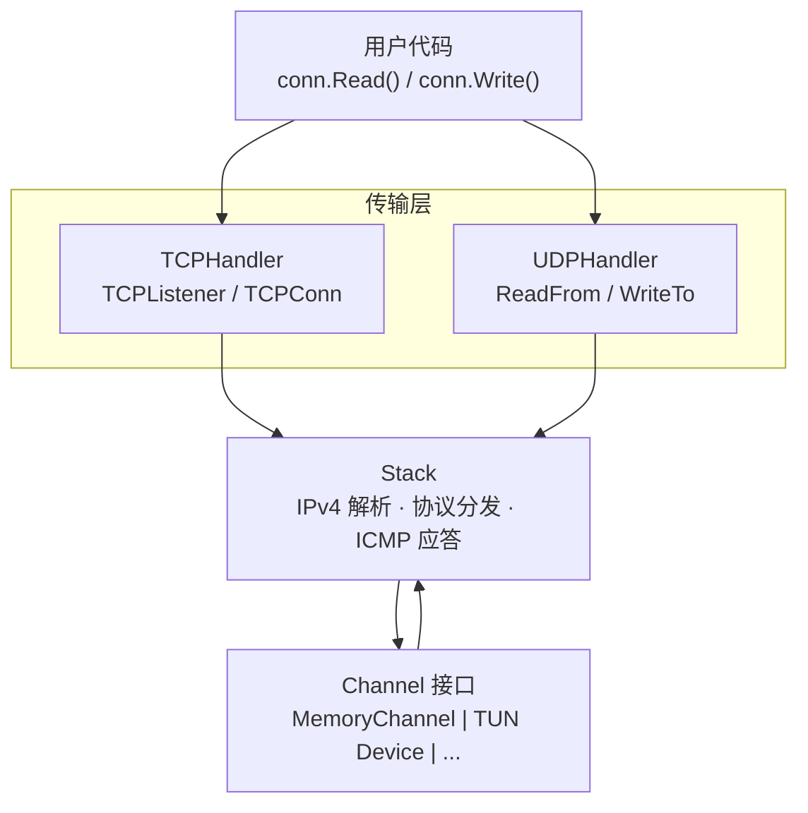
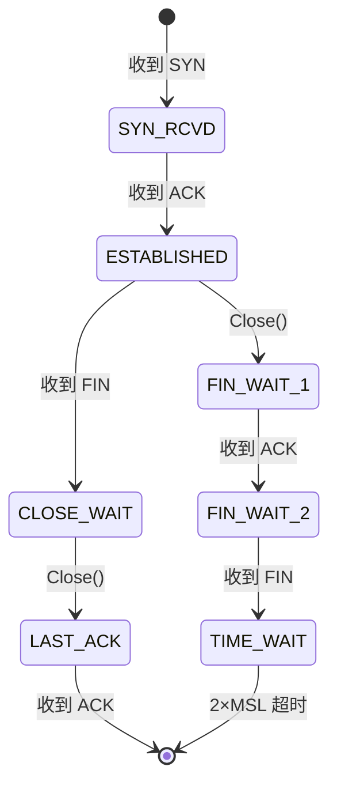

# netstack

纯 Go 实现的用户态 IPv4 网络协议栈，专为 TUN 网关场景设计。

## 特性

- **IPv4** — 头部解析/构建、校验和验证
- **TCP** — 服务端全状态机：三次握手、数据传输、优雅关闭
  - TCP 选项：MSS、窗口缩放 (RFC 7323)、SACK (RFC 2018)、Timestamps (RFC 7323)
  - 拥塞控制：New Reno 快速恢复 (RFC 5681)
  - 可靠重传：RTO 定时器、最大重试限制、RTTM 时间戳测量
  - Nagle 算法 (RFC 1122)、`SetNoDelay` 禁用
  - 接收端 SWS 避免 (Clark's algorithm, RFC 1122)
  - PAWS 防回绕序列号保护 (RFC 7323)
- **UDP** — PacketConn 风格 API（ReadFrom / WriteTo），上层自由处理数据
- **ICMP** — 自动 Echo Reply（ping 响应）
- 零拷贝包缓冲区 + `sync.Pool` 对象复用

## 架构



## 安装

```bash
go get github.com/Zwlin98/netstack
```

## 快速开始

### 创建网络栈并接收 TCP 连接

```go
package main

import (
	"fmt"

	"github.com/Zwlin98/netstack/channel"
	"github.com/Zwlin98/netstack/stack"
	"github.com/Zwlin98/netstack/tcpip"
	"github.com/Zwlin98/netstack/transport/tcp"
	"github.com/Zwlin98/netstack/transport/udp"
)

func main() {
	// 1. 创建 Channel（实际使用时替换为 TUN 设备）
	ch := channel.NewMemory(1500)

	// 2. 创建协议栈（可选配置）
	s := stack.New(ch)

	// 3. 注册传输层处理器（可选配置）
	tcpHandler := tcp.NewTCPHandler(s)
	udpHandler := udp.NewUDPHandler(s)
	s.RegisterHandler(tcpip.TCPProtocolNumber, tcpHandler)
	s.RegisterHandler(tcpip.UDPProtocolNumber, udpHandler)

	// 4. 启动
	s.Start()
	defer s.Stop()

	// 5. 接受 TCP 连接
	for {
		conn, err := tcpHandler.Listener().Accept()
		if err != nil {
			break
		}
		go handleConn(conn)
	}
}

func handleConn(conn *tcp.TCPConn) {
	defer conn.Close()
	remote := conn.RemoteAddr()
	fmt.Printf("新连接: %s:%d\n", remote.Addr, remote.Port)

	buf := make([]byte, 4096)
	for {
		n, err := conn.Read(buf)
		if err != nil {
			return
		}
		conn.Write(buf[:n]) // echo
	}
}
```

### 自定义配置

每层构造函数通过 Functional Options 注入配置，不传则使用 RFC 推荐的默认值：

```go
// Stack 层
s := stack.New(ch,
    stack.WithTTL(128),
    stack.WithOutboundQueueSize(1024),
)

// TCP 层
tcpHandler := tcp.NewTCPHandler(s,
    // 缓冲区
    tcp.WithReadBufferSize(512*1024),
    tcp.WithWriteBufferSize(512*1024),
    tcp.WithAcceptQueueSize(64),

    // Keepalive
    tcp.WithKeepaliveIdle(60*time.Second),
    tcp.WithKeepaliveInterval(10*time.Second),
    tcp.WithKeepaliveCount(3),

    // 超时
    tcp.WithFinWait2Timeout(30*time.Second),
    tcp.WithSynRcvdTimeout(15*time.Second),
    tcp.WithTimeWaitDuration(30*time.Second),

    // 重传
    tcp.WithMinRTO(100*time.Millisecond),
    tcp.WithMaxRTO(30*time.Second),
    tcp.WithMaxRetries(10),
)

// UDP 层
udpHandler := udp.NewUDPHandler(s,
    udp.WithInboundQueueSize(1024),
)
```

### 接入 TUN 设备

内置 `channel/tun` 包，直接创建 Linux TUN 设备（需要 root 权限）：

```go
import "github.com/Zwlin98/netstack/channel/tun"

ch, err := tun.NewChannel("tun0", 1500)
if err != nil {
    log.Fatal(err)
}

s := stack.New(ch)
// ... 注册 handler、启动 ...
```

如需对接其他网络设备，实现 `channel.Channel` 接口即可：

```go
type Channel interface {
	ReadPacket(buf []byte) (int, error)  // 从设备读一个 IP 包
	WritePacket(data []byte) error       // 向设备写一个 IP 包
	Close() error
	MTU() int
}
```

### UDP 数据报收发

UDP handler 提供 `net.PacketConn` 风格的 API，上层自行决定如何处理数据（NAT 转发、DNS 劫持、过滤等）：

```go
udpHandler := udp.NewUDPHandler(s)
s.RegisterHandler(tcpip.UDPProtocolNumber, udpHandler)

go func() {
	buf := make([]byte, 1500)
	for {
		// 读取入站 UDP 数据报（纯 payload，不含协议头）
		n, src, dst, err := udpHandler.ReadFrom(buf)
		if err != nil {
			break
		}
		// src = 客户端地址, dst = 原始目标地址
		// 上层自行决定处理方式：转发、修改、丢弃...
		resp := handleUDP(dst, buf[:n])
		// 将响应写回客户端（handler 自动构建 UDP+IPv4 头）
		udpHandler.WriteTo(resp, dst, src)
	}
}()
```

## 包结构

| 包 | 说明 |
|---|------|
| `tcpip` | 核心类型：`Address`、`FullAddress`、协议号、错误定义 |
| `header` | 零拷贝协议头视图：IPv4、TCP、UDP、ICMPv4 + 校验和 |
| `packet` | `PacketBuffer` — 带 headroom 的包缓冲区，`sync.Pool` 复用 |
| `channel` | `Channel` 接口 + `MemoryChannel`（内存实现，用于测试） |
| `stack` | 协议栈核心：IPv4 解析、协议分发、ICMP、读写循环、`Config` + `Option` |
| `transport/tcp` | TCP 实现：`TCPHandler` / `TCPListener` / `TCPConn`、`Config` + `Option` |
| `transport/udp` | UDP 数据报收发：`UDPHandler`（ReadFrom / WriteTo）、`Config` + `Option` |

## TCP 状态机



## 设计要点

- **IPv4-only** — 不支持 IPv6
- **服务端 TCP** — 支持 Listen/Accept，不支持主动 Dial
- **TUN 网关** — 面向内网设备，client→gateway 存在真实网络 RTT
- **gVisor 风格** — `[]byte` 命名类型作为协议头视图，零分配解析

## 测试

```bash
go test ./...
```

TCP 测试包含从 [gVisor](https://github.com/google/gvisor) 移植的工业级测试用例，覆盖握手边界条件、拥塞控制、连接关闭和 RFC 合规性。
