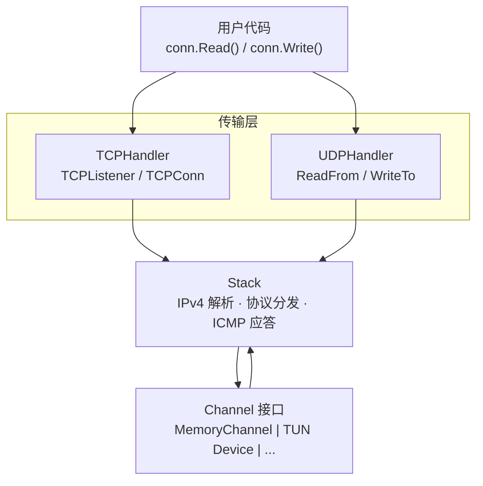
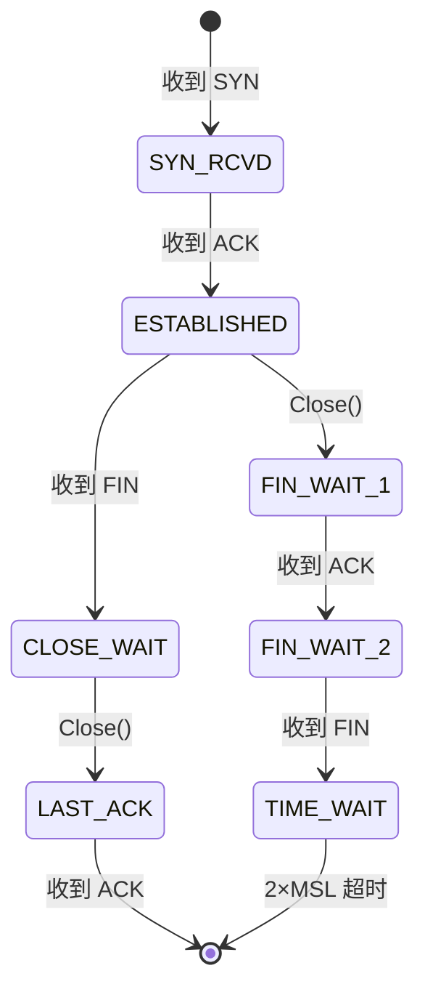

# netstack

纯 Go 实现的用户态 IPv4 网络协议栈，专为网关场景设计。

## 特性

- **IPv4** — 头部解析/构建、校验和验证
- **TCP** — 服务端全状态机：三次握手、数据传输、半关闭、优雅关闭
  - TCP 选项：MSS 协商、窗口缩放 (RFC 7323)、SACK (RFC 2018)、DSACK (RFC 2883)、Timestamps (RFC 7323)
  - 拥塞控制：New Reno 快速恢复 (RFC 5681)、Limited Transmit (RFC 3042)
  - 可靠重传：RTO 定时器 (RFC 6298)、Karn 算法、SACK 驱动丢包检测、最大重试限制
  - RTT 测量：时间戳 RTTM (RFC 7323)、SRTT/RTTVAR 平滑
  - PAWS 防回绕序列号保护 (RFC 7323)
  - Nagle 算法 (RFC 1122)、`SetNoDelay` 禁用
  - Delayed ACK (RFC 1122)：200ms 延迟确认
  - SWS 避免：接收端 Clark's algorithm + 发送端抑制 (RFC 1122 §4.2.3.4)
  - 零窗口探测 (RFC 1122)
  - 接收缓冲区自动调优：按 RTT 窗口测量吞吐量，动态扩容至配置上限
  - Keepalive (RFC 1122 §4.2.3.6)：可配置 idle/interval/count
  - 超时管理：SYN_RCVD、FIN_WAIT_2、TIME_WAIT (2×MSL)
- **UDP** — PacketConn 风格 API（ReadFrom / WriteTo），上层自由处理数据
- **ICMP** — 自动 Echo Reply（ping 响应）
- **TUN** — 内置 Linux TUN 设备驱动，支持 GRO/GSO 和校验和卸载
- **GSO** — TCP 发送路径 Generic Segmentation Offload，将多个 MSS 合并为单次系统调用
- **可观测性** — 零成本可选的聚合计数器（Stack/TCP/UDP）+ 每连接快照（RTT、cwnd、窗口、缓冲区）
- 零拷贝包缓冲区 + `sync.Pool` 对象复用（含 GSO 64KB 缓冲池）

## 架构



## 安装

```bash
go get github.com/Zwlin98/netstack
```

## 快速开始

### 创建网络栈并接收 TCP 连接

```go
package main

import (
	"fmt"

	"github.com/Zwlin98/netstack/channel"
	"github.com/Zwlin98/netstack/stack"
	"github.com/Zwlin98/netstack/tcpip"
	"github.com/Zwlin98/netstack/transport/tcp"
	"github.com/Zwlin98/netstack/transport/udp"
)

func main() {
	// 1. 创建 Channel（实际使用时替换为 TUN 设备）
	ch := channel.NewMemory(1500)

	// 2. 创建协议栈（可选配置）
	s := stack.New(ch)

	// 3. 注册传输层处理器（可选配置）
	tcpHandler := tcp.NewTCPHandler(s)
	udpHandler := udp.NewUDPHandler(s)
	s.RegisterHandler(tcpip.TCPProtocolNumber, tcpHandler)
	s.RegisterHandler(tcpip.UDPProtocolNumber, udpHandler)

	// 4. 启动
	s.Start()
	defer s.Stop()

	// 5. 接受 TCP 连接
	for {
		conn, err := tcpHandler.Listener().Accept()
		if err != nil {
			break
		}
		go handleConn(conn)
	}
}

func handleConn(conn *tcp.TCPConn) {
	defer conn.Close()
	remote := conn.RemoteAddr()
	fmt.Printf("新连接: %s:%d\n", remote.Addr, remote.Port)

	buf := make([]byte, 4096)
	for {
		n, err := conn.Read(buf)
		if err != nil {
			return
		}
		conn.Write(buf[:n]) // echo
	}
}
```

### 自定义配置

每层构造函数通过 Functional Options 注入配置，不传则使用 RFC 推荐的默认值：

```go
// Stack 层
s := stack.New(ch,
    stack.WithTTL(128),
    stack.WithOutboundQueueSize(1024),
)

// TCP 层
tcpHandler := tcp.NewTCPHandler(s,
    // 缓冲区
    tcp.WithReadBufferSize(512*1024),
    tcp.WithWriteBufferSize(512*1024),
    tcp.WithMaxReadBufferSize(8*1024*1024), // 接收缓冲区自动调优上限
    tcp.WithAcceptQueueSize(64),

    // Keepalive
    tcp.WithKeepaliveIdle(60*time.Second),
    tcp.WithKeepaliveInterval(10*time.Second),
    tcp.WithKeepaliveCount(3),

    // 超时
    tcp.WithFinWait2Timeout(30*time.Second),
    tcp.WithSynRcvdTimeout(15*time.Second),
    tcp.WithTimeWaitDuration(30*time.Second),
    tcp.WithDelayedACKTimeout(100*time.Millisecond),

    // 重传
    tcp.WithMinRTO(100*time.Millisecond),
    tcp.WithMaxRTO(30*time.Second),
    tcp.WithMaxRetries(10),
)

// UDP 层
udpHandler := udp.NewUDPHandler(s,
    udp.WithInboundQueueSize(1024),
)
```

### 接入 TUN 设备

内置 `channel/tun` 包，直接创建 Linux TUN 设备（需要 root 权限）：

```go
import "github.com/Zwlin98/netstack/channel/tun"

ch, err := tun.NewChannel("tun0", 1500)
if err != nil {
    log.Fatal(err)
}

s := stack.New(ch)
// ... 注册 handler、启动 ...
```

如需对接其他网络设备，实现 `channel.Channel` 接口即可：

```go
type Channel interface {
	ReadPacket(buf []byte) (int, error)  // 从设备读一个 IP 包
	WritePacket(data []byte) error       // 向设备写一个 IP 包
	Close() error
	MTU() int
}
```

### UDP 数据报收发

UDP handler 提供 `net.PacketConn` 风格的 API，上层自行决定如何处理数据（NAT 转发、过滤等）：

```go
udpHandler := udp.NewUDPHandler(s)
s.RegisterHandler(tcpip.UDPProtocolNumber, udpHandler)

go func() {
	buf := make([]byte, 1500)
	for {
		// 读取入站 UDP 数据报（纯 payload，不含协议头）
		n, src, dst, err := udpHandler.ReadFrom(buf)
		if err != nil {
			break
		}
		// src = 客户端地址, dst = 原始目标地址
		// 上层自行决定处理方式：转发、修改、丢弃...
		resp := handleUDP(dst, buf[:n])
		// 将响应写回客户端（handler 自动构建 UDP+IPv4 头）
		udpHandler.WriteTo(resp, dst, src)
	}
}()
```

## 包结构

| 包 | 说明 |
|---|------|
| `tcpip` | 核心类型：`Address`、`FullAddress`、协议号、错误定义 |
| `header` | 零拷贝协议头视图：IPv4、TCP、UDP、ICMPv4 + 校验和 |
| `packet` | `PacketBuffer` — 带 headroom 的包缓冲区，`sync.Pool` 复用 |
| `channel` | `Channel` 接口 + `MemoryChannel`（内存实现，用于测试） |
| `channel/tun` | Linux TUN 设备驱动，支持 GRO/GSO/校验和卸载 |
| `stack` | 协议栈核心：IPv4 解析、协议分发、ICMP、读写循环、GSO 分发、`Config` + `Option` |
| `transport/tcp` | TCP 实现：`TCPHandler` / `TCPListener` / `TCPConn`、`Config` + `Option` |
| `transport/udp` | UDP 数据报收发：`UDPHandler`（ReadFrom / WriteTo）、`Config` + `Option` |

## TCP 状态机



### 可观测性

netstack 提供零成本可选的内部指标，未启用时仅增加一次 nil 指针检查，无性能损耗。

```go
// 启用各层统计（在 Start() 之前调用）
stkStats := s.EnableStats()
tcpStats := tcpHandler.EnableStats()
udpStats := udpHandler.EnableStats()

s.Start()

// 随时读取聚合计数器
fmt.Printf("TCP active: %d, retransmits: %d\n",
    tcpStats.ActiveConns.Load(),
    tcpStats.Retransmits.Load())

// 出站队列水位（不需要启用 stats）
fmt.Printf("outbound queue: %d\n", s.OutboundQueueLen())

// 每连接快照
for _, snap := range tcpHandler.ConnSnapshots() {
    fmt.Printf("%s state=%s rtt=%s cwnd=%d\n",
        snap.Flow.SrcAddr, snap.State, snap.SRTT, snap.Cwnd)
}

// 查询单个连接
if snap := tcpHandler.ConnSnapshot(flow); snap != nil {
    fmt.Printf("unacked=%d ooo=%d\n", snap.Unacked, snap.OOO)
}
```

#### Stack 指标 (`stack.Stats`)

| 字段 | 类型 | 说明 |
|------|------|------|
| `PacketsIn` | `atomic.Uint64` | 收到的有效 IPv4 输入包总数（分片按每个 fragment 计数） |
| `PacketsOut` | `atomic.Uint64` | 发出的包总数 |
| `BytesIn` | `atomic.Uint64` | 收到的 IPv4 输入字节数（按 `TotalLength`，分片按每个 fragment 计数，含头部） |
| `BytesOut` | `atomic.Uint64` | 发出的原始字节数（含所有头部） |
| `DroppedOutbound` | `atomic.Uint64` | 因出站队列满而丢弃的包 |
| `UnknownProtocol` | `atomic.Uint64` | 无注册处理器的协议包 |

另有 `Stack.OutboundQueueLen() int` 返回出站队列当前深度。

#### TCP 指标 (`tcp.Stats`)

| 分类 | 字段 | 说明 |
|------|------|------|
| 连接生命周期 | `ActiveConns` (Int64) | 当前活跃连接数 |
| | `TotalAccepted` | 累计建立的连接 |
| | `TotalClosed` | 累计关闭的连接 |
| | `TotalReset` | RST 终止的连接 |
| 流量 | `SegmentsIn` / `SegmentsOut` | TCP 段收发数 |
| | `PayloadBytesIn` / `PayloadBytesOut` | 有效载荷字节数 |
| 错误 | `ChecksumErrors` | 校验和错误 |
| | `DroppedInbound` | 连接入站队列满丢弃 |
| | `Retransmits` | RTO 重传次数 |
| | `FastRetransmits` | 快速重传次数 |
| | `DupACKsIn` | 收到的重复 ACK |
| 协议 | `ResetsSent` / `ResetsReceived` | RST 段收发数 |
| | `ZeroWindowProbes` | 零窗口探测次数 |
| | `PAWSDrops` | PAWS 丢弃的段 |
| 超时 | `TimeoutKeepalive` | Keepalive 超时断开 |
| | `TimeoutFinWait2` | FIN_WAIT_2 超时 |
| | `TimeoutSynRcvd` | SYN_RCVD 超时 |

#### TCP 连接快照 (`tcp.ConnSnapshot`)

| 字段 | 说明 |
|------|------|
| `Flow` | 四元组 |
| `State` | TCP 状态 |
| `SRTT` / `RTO` | 平滑 RTT / 重传超时 |
| `Cwnd` / `SSThresh` | 拥塞窗口 / 慢启动阈值 |
| `SndWnd` / `RcvWnd` | 对端窗口 / 本端窗口 |
| `Unacked` / `OOO` | 未确认段 / 乱序段 |
| `ReadBufUsed` / `WriteBufUsed` / `BufCap` | 缓冲区使用情况 |
| `Retries` | 当前重试次数 |
| `InRecovery` | 是否在快速恢复中 |

#### UDP 指标 (`udp.Stats`)

| 字段 | 说明 |
|------|------|
| `DatagramsIn` / `DatagramsOut` | 数据报收发数 |
| `BytesIn` / `BytesOut` | 有效载荷字节数 |
| `DroppedInbound` | 入站队列满丢弃 |
| `ChecksumErrors` | 校验和错误 |

## 设计要点

- **IPv4-only** — 不支持 IPv6
- **服务端 TCP** — 支持 Listen/Accept，不支持主动 Dial
- **TUN 网关** — 面向内网设备，client→gateway 存在真实网络 RTT

## 注意事项

- **IPv4 分片支持有限** — 支持入站 IPv4 fragment reassembly；不支持出站分片，TCP 通过 MSS 协商避免分片，UDP 拒绝超过 MTU 的出站数据报
- **不支持 IPv6** — 仅处理 IPv4 流量
- **仅被动 TCP** — 只支持 Listen/Accept，不支持主动发起连接（无 Dial/Connect/SYN_SENT）
- **MTU 上限 1500** — 不支持巨帧（Jumbo Frame）
- **无 PMTUD** — 不进行路径 MTU 发现，假定链路 MTU 固定

## 测试

### 单元测试

```bash
go test ./...
```

### 集成测试

集成测试通过 TUN 设备进行真实网络栈交互，需要 root 权限和 `tc`/`iperf3` 等工具：

```bash
# 运行全部集成测试
sudo ./test/run_all.sh

# 运行指定测试
sudo ./test/run_all.sh test/01_icmp.sh test/02_tcp_echo.sh
```

| 脚本 | 说明 |
|------|------|
| `01_icmp.sh` | ICMP Echo Reply（ping 响应） |
| `02_tcp_echo.sh` | TCP 回显基本功能 |
| `03_udp_echo.sh` | UDP 数据报收发 |
| `04_packet_loss.sh` | 丢包场景下的 TCP 重传恢复 |
| `05_concurrent.sh` | 多连接并发 |
| `06_iperf3.sh` | iperf3 吞吐量测试 |
| `07_reorder.sh` | 乱序报文处理 |
| `08_duplicate.sh` | 重复报文处理 |
| `09_jitter.sh` | 网络抖动场景 |
| `10_bandwidth.sh` | 带宽限制场景 |
| `11_large_transfer.sh` | 大数据量传输 |
| `12_stress.sh` | 高并发压力测试 |
| `13_combined.sh` | 组合网络劣化（丢包+延迟+乱序） |
| `14_zero_window.sh` | 零窗口探测 |
| `15_conn_lifecycle.sh` | 连接生命周期（建立→传输→关闭） |
| `16_half_close.sh` | 半关闭（单向 shutdown） |
| `17_abrupt_disconnect.sh` | 异常断开（RST 处理） |
| `18_gso_verify.sh` | GSO 分段验证（strace writev 追踪） |
| `19_stats.sh` | 可观测性计数器验证 |

## 致谢

本项目的设计灵感来自 [gVisor](https://github.com/google/gvisor) 的用户态网络栈实现。
